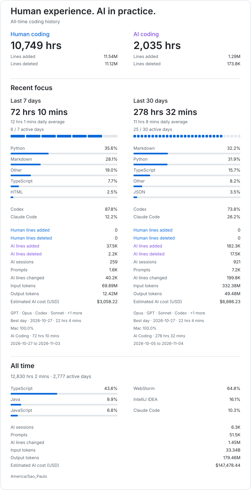

# Olá, tudo bem? 🤘

<!--START_SECTION:waka-->

## Coding activity

<picture>
  <source media="(max-width: 540px)" srcset="assets/wakatime-profile-mobile.svg">
  <source media="(prefers-color-scheme: dark)" srcset="assets/wakatime-profile-dark.svg">
  
</picture>

Complete historical measurements

Period: 2016-06-07T03:00:00Z to 2026-11-07T02:59:59Z.
Time zone: America/Sao\_Paulo.

Best day: 2026-09-19 — 21 hrs 43 mins.

#### Languages

| Name | Time | Share |
| --- | --- | --- |
| TypeScript | 5,598 hrs 57 mins | 43.55% |
| Java | 1,272 hrs 50 mins | 9.90% |
| JavaScript | 869 hrs 28 mins | 6.76% |
| YAML | 590 hrs 22 mins | 4.59% |
| JSON | 559 hrs 17 mins | 4.35% |
| Markdown | 519 hrs 56 mins | 4.04% |
| Python | 510 hrs 59 mins | 3.97% |
| Other | 467 hrs 54 mins | 3.64% |
| Vue.js | 446 hrs 32 mins | 3.47% |
| Groovy | 305 hrs 49 mins | 2.38% |
| SQL | 273 hrs 56 mins | 2.13% |
| HTML | 220 hrs 20 mins | 1.71% |
| GraphQL | 190 hrs 33 mins | 1.48% |
| Transact-SQL | 171 hrs 31 mins | 1.33% |
| Bash | 150 hrs 10 mins | 1.17% |
| Terraform | 135 hrs 58 mins | 1.06% |
| XML | 88 hrs 59 mins | 0.69% |
| Docker | 52 hrs 57 mins | 0.41% |
| Text | 41 hrs 30 mins | 0.32% |
| textmate | 35 hrs 54 mins | 0.28% |
| CSS | 25 hrs 21 mins | 0.20% |
| .env file | 24 hrs 11 mins | 0.19% |
| SCSS | 23 hrs 12 mins | 0.18% |
| TOML | 20 hrs 37 mins | 0.16% |
| Shell Script | 20 hrs 12 mins | 0.16% |
| Java Server Page | 20 hrs 2 mins | 0.16% |
| yarn.lock | 18 hrs 25 mins | 0.14% |
| Kotlin | 17 hrs 4 mins | 0.13% |
| Rust | 14 hrs 40 mins | 0.11% |
| Ruby | 14 hrs 37 mins | 0.11% |
| HTTP Request | 11 hrs 11 mins | 0.09% |
| Git Config | 11 hrs 2 mins | 0.09% |
| Properties | 10 hrs 48 mins | 0.08% |
| Nucleus | 10 hrs 23 mins | 0.08% |
| CSV | 9 hrs 48 mins | 0.08% |
| GitIgnore file | 9 hrs 12 mins | 0.07% |
| TSConfig | 8 hrs 59 mins | 0.07% |
| HCL | 8 hrs 55 mins | 0.07% |
| Dockerfile | 6 hrs 55 mins | 0.05% |
| Go | 4 hrs 31 mins | 0.04% |
| Dart | 3 hrs 54 mins | 0.03% |
| PowerQuery | 3 hrs 21 mins | 0.03% |
| Gradle | 3 hrs 16 mins | 0.03% |
| CSV/TSV | 3 hrs 11 mins | 0.02% |
| MJML | 2 hrs 55 mins | 0.02% |
| Diff | 2 hrs 53 mins | 0.02% |
| tsconfig | 2 hrs 49 mins | 0.02% |
| Robotframework | 2 hrs 45 mins | 0.02% |
| Assembly | 2 hrs 42 mins | 0.02% |
| Mustache | 2 hrs 18 mins | 0.02% |
| Makefile | 2 hrs 10 mins | 0.02% |
| Jest Snapshot | 1 hr 59 mins | 0.02% |
| EJS | 1 hr 55 mins | 0.01% |
| Perl | 1 hr 50 mins | 0.01% |
| Image \(svg\) | 1 hr 38 mins | 0.01% |
| Gosu | 1 hr 30 mins | 0.01% |
| Nginx configuration file | 1 hr 26 mins | 0.01% |
| ERB | 1 hr 18 mins | 0.01% |
| Prisma | 1 hr 16 mins | 0.01% |
| Gettext Catalog | 1 hr 15 mins | 0.01% |
| PATCH | 1 hr 9 mins | 0.01% |
| PowerShell | 1 hr 1 mins | 0.01% |
| Java Properties | 1 hr 0 mins | 0.01% |
| JavaScript Testing Snapshot | 53 mins | 0.01% |
| Jenkinsfile | 48 mins | 0.01% |
| SVG | 45 mins | 0.01% |
| Sass | 44 mins | 0.01% |
| Docker File | 43 mins | 0.01% |
| Terraform Template | 43 mins | 0.01% |
| Jupyter | 34 mins | 0.00% |
| Ezhil | 32 mins | 0.00% |
| Batchfile | 32 mins | 0.00% |
| Scala | 31 mins | 0.00% |
| PHP | 29 mins | 0.00% |
| Requirements.txt | 26 mins | 0.00% |
| Git | 25 mins | 0.00% |
| INI | 24 mins | 0.00% |
| Velocity | 24 mins | 0.00% |
| C++ | 24 mins | 0.00% |
| MDX | 21 mins | 0.00% |
| ActionScript 3 | 18 mins | 0.00% |
| SourceMap | 17 mins | 0.00% |
| JSON-lines | 17 mins | 0.00% |
| requirements.txt | 15 mins | 0.00% |
| JSON5 | 14 mins | 0.00% |
| MySQL | 11 mins | 0.00% |
| DNS Zone | 9 mins | 0.00% |
| AUTO\_DETECTED | 7 mins | 0.00% |
| IDEA\_MODULE | 7 mins | 0.00% |
| Just | 6 mins | 0.00% |
| Objective-C | 5 mins | 0.00% |
| Cookie storage file | 5 mins | 0.00% |
| TSV | 5 mins | 0.00% |
| SPI | 5 mins | 0.00% |
| Prolog | 4 mins | 0.00% |
| SSH Config | 4 mins | 0.00% |
| JSONiq | 3 mins | 0.00% |
| CLASS | 2 mins | 0.00% |
| ActionScript | 2 mins | 0.00% |
| Protocol Buffer | 2 mins | 0.00% |
| RPMSpec | 2 mins | 0.00% |
| go.mod | 2 mins | 0.00% |
| Prettier File | 2 mins | 0.00% |
| Vue | 2 mins | 0.00% |
| Caddyfile | 2 mins | 0.00% |
| C | 1 mins | 0.00% |
| Jade | 1 mins | 0.00% |
| Manifest | 1 mins | 0.00% |
| bun.lock | 1 mins | 0.00% |
| Npm File | 1 mins | 0.00% |
| JSX | 1 mins | 0.00% |
| Smarty | Less than 1 min | 0.00% |
| PythonStub | Less than 1 min | 0.00% |
| GDB | Less than 1 min | 0.00% |
| EditorConfig | Less than 1 min | 0.00% |
| Gherkin | Less than 1 min | 0.00% |
| Todotxt | Less than 1 min | 0.00% |
| Cython | Less than 1 min | 0.00% |
| POVRay | Less than 1 min | 0.00% |
| GDScript3 | Less than 1 min | 0.00% |
| Cocoa | Less than 1 min | 0.00% |
| Flow | Less than 1 min | 0.00% |
| LESS | Less than 1 min | 0.00% |
| ESLint File | Less than 1 min | 0.00% |
| Ignore File | Less than 1 min | 0.00% |
| ApacheConf | Less than 1 min | 0.00% |
| reStructuredText | Less than 1 min | 0.00% |
| CBM BASIC V2 | Less than 1 min | 0.00% |
| Kubernetes Helm File | Less than 1 min | 0.00% |
| D | Less than 1 min | 0.00% |
| C\# | Less than 1 min | 0.00% |
| DockerIgnore file | Less than 1 min | 0.00% |
| DTD | Less than 1 min | 0.00% |
| Tcsh | Less than 1 min | 0.00% |
| Swift | Less than 1 min | 0.00% |
| RBS | Less than 1 min | 0.00% |
| Cheetah | Less than 1 min | 0.00% |
| Fish | Less than 1 min | 0.00% |
| fish | Less than 1 min | 0.00% |

#### Editors

| Name | Time | Share |
| --- | --- | --- |
| WebStorm | 8,318 hrs 45 mins | 64.70% |
| IntelliJ IDEA | 2,061 hrs 44 mins | 16.04% |
| Claude Code | 1,332 hrs 59 mins | 10.37% |
| Codex | 334 hrs 27 mins | 2.60% |
| VS Code | 264 hrs 30 mins | 2.06% |
| PyCharm | 177 hrs 27 mins | 1.38% |
| Unknown Editor | 120 hrs 21 mins | 0.94% |
| Eclipse | 100 hrs 34 mins | 0.78% |
| Atom | 58 hrs 17 mins | 0.45% |
| DataGrip | 36 hrs 5 mins | 0.28% |
| Cursor | 17 hrs 19 mins | 0.13% |
| RubyMine | 10 hrs 55 mins | 0.08% |
| Rubymine | 8 hrs 54 mins | 0.07% |
| Sublime Text | 8 hrs 38 mins | 0.07% |
| Webstorm | 3 hrs 31 mins | 0.03% |
| GoLand | 2 hrs 25 mins | 0.02% |
| Codex CLI | 1 mins | 0.00% |
| Codex Exec | Less than 1 min | 0.00% |

#### Operating systems

| Name | Time | Share |
| --- | --- | --- |
| Mac | 8,857 hrs 55 mins | 68.90% |
| Linux | 3,648 hrs 54 mins | 28.38% |
| Windows | 326 hrs 1 mins | 2.54% |
| Unknown OS | 24 hrs 9 mins | 0.19% |

#### Activity categories

| Name | Time | Share |
| --- | --- | --- |
| Coding | 10,749 hrs 31 mins | 83.61% |
| AI Coding | 2,062 hrs 57 mins | 16.05% |
| Writing Docs | 40 hrs 52 mins | 0.32% |
| Writing Tests | 3 hrs 40 mins | 0.03% |

#### AI and human activity

| Measurement | Value |
| --- | --- |
| AI lines added | 1,309,365 |
| AI lines deleted | 175,352 |
| Human lines added | 11,539,423 |
| Human lines deleted | 11,117,769 |
| AI lines changed | 1,471,917 |
| Input tokens | 33,364,981,649 |
| Output tokens | 183,463,845 |
| Estimated AI cost (USD) | $147,872.5743 |
| AI sessions | 6,356 |
| Prompts | 52,221 |
| Total prompt characters | 582,261,467 |
| Prompt characters (mean) | 11,150 |
| Prompt characters per session (mean) | 13,205 |
| Prompt characters per session (median) | 7,990 |
| Prompts per session (mean) | 8 |
| Prompts per session (median) | 3 |

| AI model | Lines changed | Estimated cost (USD) |
| --- | --- | --- |
| GPT | 631,990 | $102,962.4444 |
| Claude | 522,078 | $19,124.8519 |
| Opus | 311,843 | $17,887.6407 |
| Cursor | 3,480 | $0.0000 |
| Codex | 1,875 | $6,208.6883 |
| Fable | 445 | $46.1292 |
| Sonnet | 185 | $886.9628 |
| Vscode-Wakatime | 21 | $739.8199 |
| Haiku | 0 | $16.0371 |

Source: [WakaTime](https://wakatime.com/@onhate). AI costs are estimates. Recent totals follow WakaTime's date ranges and can exclude today.

<!--END_SECTION:waka-->

